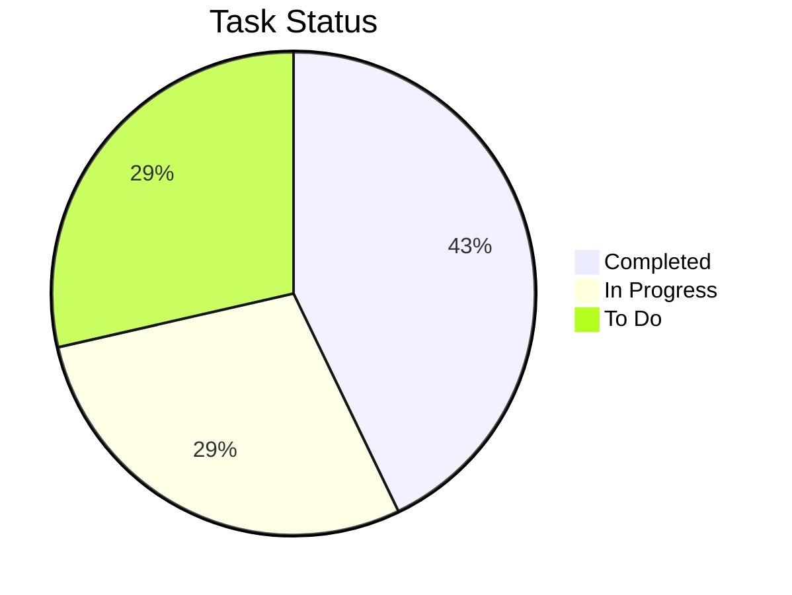
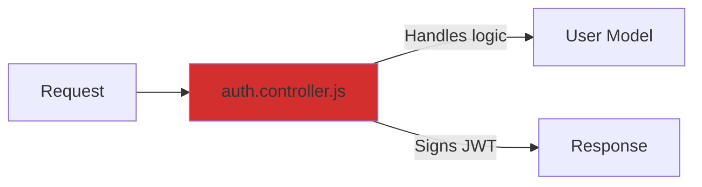
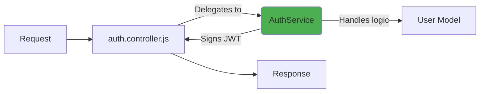

# Task: Refactor User Auth to a Dedicated Service

This is a live dashboard tracking the AI agent's progress on refactoring the user authentication system.

## 📊 **Overall Progress: 60%**



---

## ✅ **Task Breakdown & Human Oversight**

The agent has broken down the task into the following steps. As a supervisor, you can review and check/uncheck boxes to guide the agent's focus.

### **Phase 1: Planning & Setup**
- [x] Analyze existing authentication logic in `auth.controller.js`
- [x] Define the API contract for the new `AuthService`
- [x] Set up the basic file structure for the `AuthService`

### **Phase 2: Implementation**
- [x] Implement the `login` method in `AuthService`
- [ ] Implement the `register` method in `AuthService`
- [ ] Implement the `verifyToken` method in `AuthService`

### **Phase 3: Integration & Cleanup**
- [ ] Refactor `auth.controller.js` to use `AuthService`
- [ ] Remove old authentication logic
- [ ] Write integration tests for the new service

---

## 📂 **Files Modified by Agent**

Here are the files the agent has created or changed so far.

```bash
CREATED:  src/services/AuthService.ts
MODIFIED: src/controllers/auth.controller.js
MODIFIED: src/routes/auth.routes.js
```

---

## 🧐 **Proposed Changes for Review**

The agent is proposing the following changes. Please review and approve.

### **`src/services/AuthService.ts`**
```diff
+ // src/services/AuthService.ts
+
+ import { User } from '../models/user.model';
+ import jwt from 'jsonwebtoken';
+
+ export class AuthService {
+   public async login(email: string, pass: string): Promise<string | null> {
+     const user = await User.findOne({ where: { email } });
+     if (!user || !user.verifyPassword(pass)) {
+       return null;
+     }
+
+     const token = jwt.sign({ id: user.id }, process.env.JWT_SECRET!, { expiresIn: '1d' });
+     return token;
+   }
+
+   // ... other methods to be implemented
+ }
```

### **Human Approval**
Use these checkboxes to approve the agent's work or request changes.

- [ ] **Approve Changes**: The code looks good. Proceed to the next step.
- [ ] **Request Revisions**: The agent needs to make changes.

```prompt
The login method looks good, but please add JSDoc comments to explain what it does and what the parameters are before you continue.
```

---

## 🤖 **Agent's Live Journal**

A transparent log of the agent's thought process and actions.

- **[10:32:01]** Task received. Starting analysis of `auth.controller.js`.
- **[10:32:45]** Identified tight coupling between request handling and password verification. A dedicated service is a good approach.
- **[10:33:15]** Defined API for `AuthService` with `login`, `register`, `logout`, and `verifyToken` methods.
- **[10:34:02]** Created new file `src/services/AuthService.ts`.
- **[10:36:51]** Implemented the `login` method, including user lookup, password verification, and JWT signing.
- **[10:37:00]** Pausing implementation. Submitting the new `AuthService.ts` file for human review and approval. Waiting for feedback.

---

## 🏗️ **Proposed Architecture Change**

The agent has generated a diagram showing how the refactor will change the system architecture.

### **Before**


### **After (Proposed)**


> This markdown file serves as the single source of truth for this task, combining project management, code review, and progress reporting into one simple, interactive document. 