# TypeScript Setup Made Simple

Stop wrestling with tsconfig.json. Here are configurations that actually work.

## TypeScript Project Types

```mermaid
flowchart TD
    A["🚀 New Project"] --> B{"Project Type?"}
    B --> C["🌐 Frontend App"]
    B --> D["🖥️ Node.js API"]
    B --> E["📦 NPM Library"]
    
    C --> F["React/Vue Config"]
    D --> G["Node.js Config"]
    E --> H["Library Config"]
    
    style A fill:#2196f3
    style C fill:#4caf50
    style D fill:#ff9800
    style E fill:#e91e63
```



## Quick TypeScript Setup

### Install TypeScript
```bash
npm install -D typescript @types/node
npx tsc --init
```

### Essential VS Code Extensions
```bash
# Install these extensions:
# - TypeScript Importer
# - TypeScript Hero  
# - Prettier - Code formatter
# - ESLint
```

```prompt
Help me set up TypeScript for my {{project_type}} with {{frameworks}} and {{build_tools}}
```

## Frontend App Configuration

### React/Next.js tsconfig.json
```json
{
  "compilerOptions": {
    "target": "es5",
    "lib": ["dom", "dom.iterable", "es6"],
    "allowJs": true,
    "skipLibCheck": true,
    "esModuleInterop": true,
    "allowSyntheticDefaultImports": true,
    "strict": true,
    "forceConsistentCasingInFileNames": true,
    "noFallthroughCasesInSwitch": true,
    "module": "esnext",
    "moduleResolution": "node",
    "resolveJsonModule": true,
    "isolatedModules": true,
    "noEmit": true,
    "jsx": "react-jsx",
    "baseUrl": ".",
    "paths": {
      "@/*": ["./src/*"],
      "@/components/*": ["./src/components/*"],
      "@/utils/*": ["./src/utils/*"]
    }
  },
  "include": [
    "src/**/*",
    "next-env.d.ts"
  ],
  "exclude": [
    "node_modules",
    "dist",
    "build"
  ]
}
```

### Vue.js tsconfig.json
```json
{
  "compilerOptions": {
    "target": "esnext",
    "module": "esnext",
    "strict": true,
    "jsx": "preserve",
    "esModuleInterop": true,
    "skipLibCheck": true,
    "forceConsistentCasingInFileNames": true,
    "moduleResolution": "node",
    "allowSyntheticDefaultImports": true,
    "sourceMap": true,
    "baseUrl": ".",
    "types": ["vite/client"],
    "paths": {
      "@/*": ["src/*"]
    },
    "lib": ["esnext", "dom"]
  },
  "include": ["src/**/*.ts", "src/**/*.vue"],
  "exclude": ["node_modules"]
}
```

## Node.js API Configuration

### Express/Fastify tsconfig.json
```json
{
  "compilerOptions": {
    "target": "es2020",
    "module": "commonjs",
    "lib": ["es2020"],
    "outDir": "./dist",
    "rootDir": "./src",
    "strict": true,
    "esModuleInterop": true,
    "skipLibCheck": true,
    "forceConsistentCasingInFileNames": true,
    "resolveJsonModule": true,
    "declaration": false,
    "removeComments": true,
    "emitDecoratorMetadata": true,
    "experimentalDecorators": true,
    "baseUrl": ".",
    "paths": {
      "@/*": ["./src/*"],
      "@/models/*": ["./src/models/*"],
      "@/controllers/*": ["./src/controllers/*"]
    }
  },
  "include": ["src/**/*"],
  "exclude": ["node_modules", "dist"]
}
```

### Package.json Scripts
```json
{
  "scripts": {
    "build": "tsc",
    "dev": "ts-node-dev --respawn --transpile-only src/index.ts",
    "start": "node dist/index.js",
    "type-check": "tsc --noEmit"
  }
}
```

```prompt
My Node.js TypeScript project has import/export issues. Help me fix the module configuration: {{current_config}}
```

## Library/Package Configuration

### NPM Library tsconfig.json
```json
{
  "compilerOptions": {
    "target": "es2018",
    "module": "esnext",
    "lib": ["es2018"],
    "declaration": true,
    "declarationMap": true,
    "outDir": "./dist",
    "rootDir": "./src",
    "strict": true,
    "esModuleInterop": true,
    "skipLibCheck": true,
    "forceConsistentCasingInFileNames": true,
    "moduleResolution": "node",
    "allowSyntheticDefaultImports": true,
    "experimentalDecorators": true,
    "emitDecoratorMetadata": true
  },
  "include": ["src/**/*"],
  "exclude": ["node_modules", "dist", "**/*.test.ts"]
}
```

### Build Multiple Formats
```json
{
  "name": "my-library",
  "version": "1.0.0",
  "main": "dist/index.js",
  "module": "dist/index.esm.js",
  "types": "dist/index.d.ts",
  "files": ["dist"],
  "scripts": {
    "build": "rollup -c",
    "build:types": "tsc --emitDeclarationOnly"
  }
}
```

## Type Declarations Management

### Install Common Types
```bash
npm install -D @types/node @types/express @types/cors @types/helmet
npm install -D @types/react @types/react-dom  # For React
npm install -D @types/jest @types/supertest    # For testing
```

### Custom Type Declarations
```typescript
// types/global.d.ts
declare global {
  namespace NodeJS {
    interface ProcessEnv {
      DATABASE_URL: string;
      JWT_SECRET: string;
      PORT?: string;
    }
  }
}

// types/express.d.ts
declare namespace Express {
  interface Request {
    user?: {
      id: string;
      email: string;
    };
  }
}
```

```prompt
Help me create type definitions for my custom {{library_name}} that exports {{functions_or_classes}}
```

## Strict Mode Configuration

### Gradual Adoption
```json
{
  "compilerOptions": {
    "strict": false,
    "noImplicitAny": true,
    "strictNullChecks": false,
    "strictFunctionTypes": true,
    "strictBindCallApply": true,
    "strictPropertyInitialization": false,
    "noImplicitReturns": true,
    "noFallthroughCasesInSwitch": true
  }
}
```

### Full Strict Mode
```json
{
  "compilerOptions": {
    "strict": true,
    "noUnusedLocals": true,
    "noUnusedParameters": true,
    "noImplicitReturns": true,
    "noFallthroughCasesInSwitch": true,
    "noUncheckedIndexedAccess": true
  }
}
```

## Build and Development Tools

### ts-node-dev for Development
```bash
npm install -D ts-node-dev
```

```json
{
  "scripts": {
    "dev": "ts-node-dev --respawn --transpile-only --ignore-watch node_modules src/index.ts"
  }
}
```

### TSC Watch Mode
```bash
tsc --watch
```

### Vite with TypeScript
```bash
npm create vite@latest my-app -- --template react-ts
```

## Common TypeScript Issues

### Module Resolution Issues
```json
{
  "compilerOptions": {
    "moduleResolution": "node",
    "esModuleInterop": true,
    "allowSyntheticDefaultImports": true
  }
}
```

### Path Mapping
```json
{
  "compilerOptions": {
    "baseUrl": ".",
    "paths": {
      "@/*": ["./src/*"],
      "~/*": ["./src/*"]
    }
  }
}
```

```prompt
I'm getting "Cannot find module" errors in TypeScript. Help me debug this import issue: {{error_message}}
```

## IDE Integration

### VS Code settings.json
```json
{
  "typescript.preferences.quoteStyle": "single",
  "typescript.suggest.autoImports": true,
  "typescript.updateImportsOnFileMove.enabled": "always",
  "editor.codeActionsOnSave": {
    "source.organizeImports": true
  }
}
```

## Testing Configuration

### Jest with TypeScript
```bash
npm install -D jest @types/jest ts-jest
```

### jest.config.js
```javascript
module.exports = {
  preset: 'ts-jest',
  testEnvironment: 'node',
  roots: ['<rootDir>/src'],
  testMatch: ['**/__tests__/**/*.ts', '**/?(*.)+(spec|test).ts'],
  collectCoverageFrom: [
    'src/**/*.ts',
    '!src/**/*.d.ts',
  ],
};
```

```prompt
Set up TypeScript testing environment for {{testing_framework}} with {{project_type}}
```

## Pro Tips

- **Use strict mode** for new projects
- **Gradual adoption** for existing JavaScript projects
- **Path mapping** for cleaner imports
- **Declaration files** for better IntelliSense
- **Watch mode** during development

> **Remember**: Good TypeScript configuration is like a good foundation - set it up right once, and it supports everything you build on top! 