# Git Workflow Mastery

Beyond add, commit, push. Here's how to work like a senior developer.

## The Daily Flow

```mermaid
flowchart TD
    A["🔄 Pull Latest"] --> B["🌿 Create Branch"]
    B --> C["✏️ Make Changes"]
    C --> D["📝 Commit"]
    D --> E["🚀 Push & PR"]
    
    style A fill:#2196f3
    style B fill:#4caf50
    style C fill:#ff9800
    style D fill:#e91e63
    style E fill:#9c27b0
```



## Smart Branch Management

### Create and Switch
```bash
git checkout -b feature/new-login
```

### Quick Switch
```bash
git switch main
git switch -
```

### Clean Up Merged Branches
```bash
git branch --merged | grep -v main | xargs git branch -d
```

```prompt
I need to create a feature branch for {{feature_description}}. What's the best naming convention and workflow?
```

## Commit Like a Pro

### Interactive Staging
```bash
git add -p
```

### Amend Last Commit
```bash
git commit --amend -m "Better commit message"
```

### Commit with Template
```bash
git commit -m "feat: add user authentication

- Add login form validation
- Implement JWT token handling
- Add password reset flow"
```

## Undo Mistakes Safely

### Unstage Files
```bash
git reset HEAD file.js
```

### Undo Last Commit (Keep Changes)
```bash
git reset --soft HEAD~1
```

### Discard Local Changes
```bash
git checkout -- file.js
```

### Nuclear Option (Be Careful!)
```bash
git reset --hard HEAD
```

```prompt
I accidentally committed sensitive data. How do I remove it from Git history completely?
```

## Remote Collaboration

### Sync with Remote
```bash
git fetch origin
git pull --rebase origin main
```

### Push New Branch
```bash
git push -u origin feature/new-feature
```

### Force Push (After Rebase)
```bash
git push --force-with-lease
```

## Stash Your Work

```bash
git stash push -m "WIP: working on feature"
git stash pop
git stash list
```

## View History Like a Human

```bash
git log --oneline --graph --decorate
```

```bash
git log --since="2 weeks ago" --author="YourName"
```

```prompt
Help me write a better commit message for these changes: {{git_diff_output}}
```

## The Rebase Secret

```bash
git rebase -i HEAD~3
```

> **Coming Soon**: Advanced Git features like worktrees, bisect, and reflog that will change how you work! 