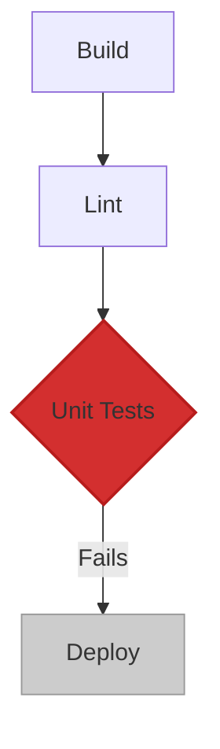

# Build Failure Report: `main` branch

A build failed on the `main` branch. This is an auto-generated report to help diagnose the issue quickly.

- **Commit:** [`a1b2c3d`](https://github.com/your-repo/commit/a1b2c3d) - "feat: Add user profile caching"
- **Author:** `@Griever`
- **Timestamp:** `2024-07-29 10:30:00 UTC`
- **Pipeline:** `Production Build & Deploy`
- **Status:** `Failed` ❌

## 1. AI-Generated Summary

The build pipeline failed during the **Unit Tests** stage. Specifically, the `user.service.test.ts` test suite is failing due to a timeout when trying to connect to the test Redis instance. This is likely caused by a misconfiguration in the test environment or an issue with the Dockerized Redis service in the CI environment.


## 2. Failure Analysis



### **Failed Stage: Unit Tests**

#### **Relevant Log Output:**
*Collapsible section with the full test runner output.*

<details>
<summary>Click to expand full test logs</summary>

```
FAIL src/services/user.service.test.ts
  ● User Service › caching › should cache the user profile after the first fetch

    Timeout - Async callback was not invoked within the 5000 ms timeout specified by jest.setTimeout.

      at src/services/user.service.ts:45:15
      at Object.<anonymous> (src/services/user.service.test.ts:33:5)
```
</details>


## 3. Debugging Assistant

Use these prompts to get help from our debugging AI.

### **Explain the Error**
```prompt
Explain this Jest timeout error to me. What are the common causes for 'Async callback was not invoked' in a test environment?
```

### **Check Related Services**
```prompt
Check the logs for the `test-redis` container from the CI build. Was it running correctly at the time of the test execution?
```

### **Propose a Fix**
```prompt
Based on the error log and the code in `user.service.ts`, propose a fix for this failing test. The relevant code is: {{user_service_code}}
```

## 4. Suggested Actions

Based on the failure, here are the likely next steps:

- [ ] **Check CI Configuration:** Verify that the `REDIS_URL` is correctly passed to the test environment in the `github-actions-ci.yml` file.
- [ ] **Inspect Test Code:** Review `user.service.test.ts` to ensure the Redis client is being connected and disconnected properly in `beforeAll` and `afterAll` hooks.
- [ ] **Re-run Job:** Once a fix is pushed, you can re-run the failed job directly from here.
  ```bash
  gh workflow run "CI/CD Pipeline" --ref main --input "job=unit-tests"
  ```


> **The Guidewire Advantage:** Instead of raw log files, developers get a structured, intelligent, and interactive report when a build fails. This reduces the time to diagnose and fix issues from hours to minutes. 