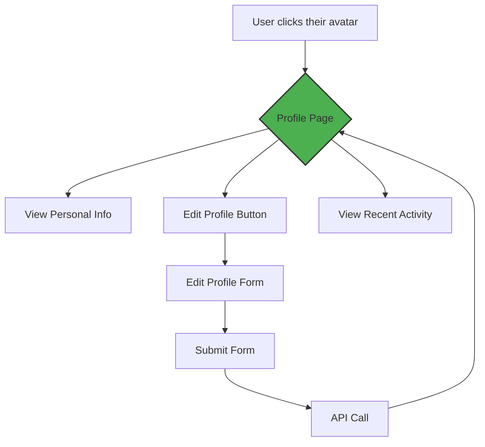

# Design Spec: New User Profile Page

This document outlines the design, user flow, and component breakdown for the new user profile page. It replaces a traditional Figma file.

**Status:** `[ ] In Discussion` `[x] Ready for Dev` `[ ] Done`


## 1. User Flow

How does a user get to their profile and what can they do?




## 2. Page Wireframe & Layout

This is a low-fidelity wireframe. We're using a simple grid layout.

```mermaid
graph TD
    subgraph "Header"
        direction LR
        Logo --> NavLinks
    end

    subgraph "Profile Page"
        direction TB
        subgraph "Left Pane (30%)"
            Avatar(Avatar<br/>[Image])
            Username(Username<br/>[h1])
            Bio(Bio<br/>[p])
            EditButton([Edit Profile Button])
        end
        subgraph "Right Pane (70%)"
            direction TB
            Tabs(Tabs: [Activity, Settings]) --> Content{Content Area}
        end
    end
    
    Avatar --> EditButton

    style Left Pane fill:#f9f9f9,stroke:#ccc
    style Right Pane fill:#f9f9f9,stroke:#ccc
```


## 3. Component Breakdown

These are the new React components we'll need to build.

### `ProfileAvatar.tsx`
- **Props:**
  - `imageUrl: string`
  - `username: string`
  - `size: 'sm' | 'md' | 'lg'`
- **Notes:** Should include a fallback default image.

### `ProfileCard.tsx`
- **Composition:** Uses `ProfileAvatar`.
- **Props:**
  - `user: User`
- **Contains:** Displays user's name, bio, and join date.

### `ActivityFeed.tsx`
- **Data:** Fetches data from `/api/users/:id/activity`.
- **Notes:** Should have a loading state and an empty state.


## 4. Design Review & Feedback

Use this checklist for the design review process.

- [x] **Product:** Does the flow meet business requirements?
- [x] **Engineering:** Is the component breakdown feasible?
- [ ] **Design:** Are the visual elements consistent with the design system?
- [ ] **Accessibility:** Have we considered screen readers and keyboard navigation?

### **Open Questions / Prompts for AI Agent:**

```prompt
Based on this design, generate the boilerplate code for the `ProfileCard.tsx` component, including placeholder props and basic TailwindCSS classes for styling.
```

```prompt
Create a basic Storybook story for the `ProfileAvatar.tsx` component with controls for the `size` prop.
```

> **The Guidewire Advantage:** This entire design is a simple text file. It can be versioned with Git, reviewed in a pull request alongside the code, and used to generate boilerplate with AI prompts. It will never be out of sync with the implementation. 