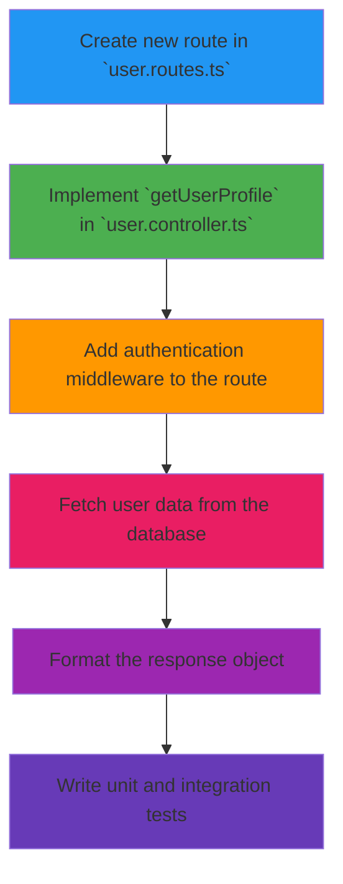

# Task: Implement User Profile Endpoint

This document replaces a traditional Jira/Trello ticket. It lives in the codebase and is managed via pull requests.

- **ID:** `TICKET-123`
- **Status:** `[ ] To Do` `[x] In Progress` `[ ] In Review` `[ ] Done`
- **Assignee:** `AI Agent 1` / `@Griever`
- **Epic:** `User Account Management`
- **Sprint:** `Sprint 3 (ending 2024-08-15)`
- **Related PR:** `[#42](https://github.com/your-repo/pull/42)`


## 1. Description

We need to create a new backend endpoint to retrieve a user's profile information. This will be used by the new profile page being built by the frontend team.

**Acceptance Criteria:**
- [x] Must be at the path `/api/users/:id`.
- [x] Must return a JSON object with `id`, `name`, `email`, and `joinDate`.
- [x] Must be authenticated. Only the user themselves or an admin can access it.
- [ ] Must have at least 80% test coverage.


## 2. Technical Plan

The AI agent has proposed the following technical plan.




## 3. Sub-Tasks & Progress

This checklist is updated automatically by the agent as it commits code.

- [x] Create `GET /api/users/:id` route structure.
- [x] Add `jwtAuth` middleware to the new route.
- [x] Implement the controller logic to fetch a user by ID.
- [ ] Implement authorization logic (user can only fetch their own profile).
- [ ] Write unit tests for the controller.
- [ ] Write integration test for the full endpoint.


## 4. Discussion & Blockers

A place for human-AI collaboration.

**Human Comment:**
> The acceptance criteria mention that an admin should also be able to access the profile. The current plan doesn't seem to account for that.

**AI Response & Action:**
> That's a great point. I will update the plan to include an admin role check in the authorization logic.

```prompt
Update the authorization logic in the `getUserProfile` controller to allow users with an 'admin' role to access any profile, in addition to users accessing their own. Here's the current code: {{controller_code}}
```


> **The Guidewire Advantage:** This task ticket is not in a separate system. It's a version-controlled file that lives with your code. It can be automatically updated by CI/CD and AI agents, ensuring it's never out of sync with the actual state of the project. 