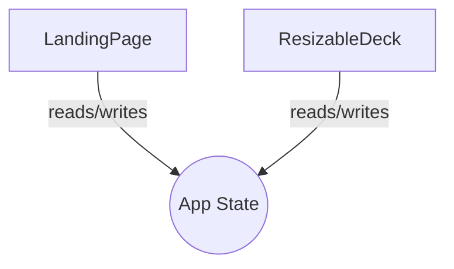

:::slide
# Welcome to PrincipleMD

This is a test slide for the VSCode extension.

- Feature 1: Markdown slides
- Feature 2: Mermaid diagrams
- Feature 3: Theme switching
:::

:::slide
# Mermaid Diagram Example

:::

:::slide
# Final Slide

Thank you for testing!

Press `Ctrl+Shift+V` to open the preview.
:::