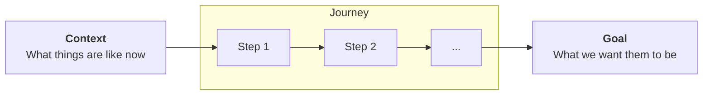
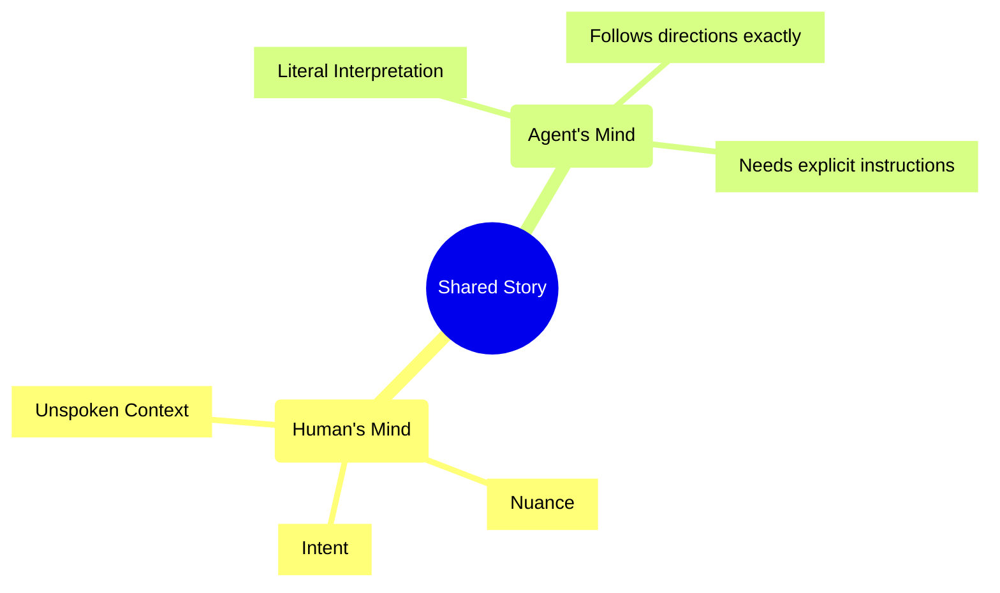
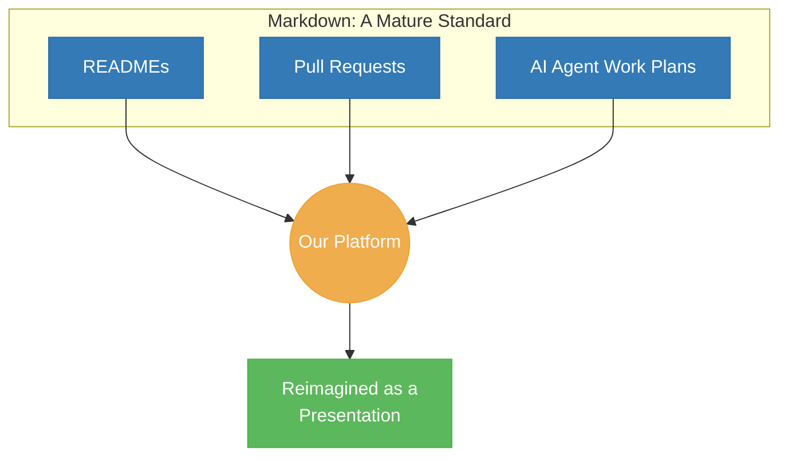

# All Writing is Storytelling

Clear stories lead to better outcomes.

## The Brave New World 

Agents write fast, but they may not always know the right things. They may understand the story a little different than we would like them to.

## Beyond Walls of Text

Large blocks of text are dense and difficult to parse. Our brains work overtime to find the signal in the noise.

    

        <h4 style="margin-top:0; color: #CCCCCC;">The Old Way: A Wall of Text</h4>
        
Our new login feature will require users to authenticate via our OAuth 2.0 provider. The front-end will send a request to the `/auth/login` endpoint. The back-end will then redirect to the provider. Upon successful authentication, the provider will call our `/auth/callback` endpoint with a temporary code. The back-end will exchange this code for an access token and a refresh token. The access token will be stored in a secure, HTTP-only cookie with a short expiry, while the refresh token will be stored in the database, linked to the user's account for session renewal.

    

    
&rarr;

    

        <h4 style="margin-top:0; color: #CCCCCC;">The New Way: A Clear Story</h4>
        <ul style="font-size: 0.9em; text-align: left; padding-left: 20px; color: #AAAAAA;">
            <li><b>User Action:</b> Clicks Login</li>
            <li><b>Process:</b> Authenticates via OAuth</li>
            <li><b>Result:</b> Secure session created</li>
            <li><b>Key Tech:</b> HTTP-only cookie</li>
        </ul>
    

Custom presentations, generated from the same source material, transform dense information into a clear, digestible narrative.

## A Mature Standard Reimagined:

No account needed to try us out. View README's, pull requests, or ask your agent to make you a markdown file of what they plan on doing. Your documentation becomes your presentation, seamlessly.

## What's Next?

Nobody likes a presentation that goes on for too long. 

If you'd like to see more, you can explore our other examples or try creating a presentation for yourself.

## Start Telling Better Stories

Embrace a new way of building software, where clear communication and powerful AI work hand-in-hand. 