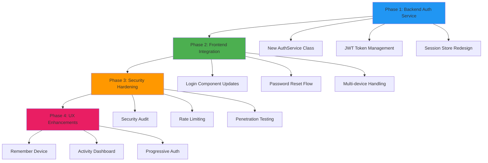

# Agent Proposal: User Authentication Refactor

**Created by:** `AI Agent 2`
**Priority:** `Medium`
**Estimated Effort:** `3-4 days`
**Requires Principle Approval:** `Yes`

---

## Problem Statement

The current authentication system has several issues that are impacting user experience and system reliability:

- **Session timeouts** are too aggressive (30 minutes)
- **Password reset flow** has a 23% abandonment rate
- **Multi-device login** causes confusion and lockouts
- **Security vulnerabilities** in JWT token handling

## Proposed Solution

Refactor the authentication system with the following improvements:

### **Technical Changes**
- [ ] Implement sliding session windows (extend on activity)
- [ ] Add magic link authentication as password reset alternative
- [ ] Support multiple concurrent sessions per user
- [ ] Upgrade to secure JWT handling with proper rotation

### **User Experience Improvements**
- [ ] Add "Remember this device" option
- [ ] Implement progressive authentication (email → SMS → biometric)
- [ ] Create unified logout across all devices
- [ ] Add login activity dashboard for users

---

## Implementation Plan



---

## Impact Analysis

### **Positive Impacts**
- **User satisfaction:** Reduced friction in login process
- **Security:** Modern, secure authentication patterns
- **Support load:** Fewer "I can't log in" tickets
- **Mobile experience:** Better cross-device behavior

### **Risks & Mitigations**
- **Risk:** Breaking existing user sessions
  - **Mitigation:** Gradual rollout with backward compatibility
- **Risk:** Increased complexity
  - **Mitigation:** Comprehensive testing and documentation
- **Risk:** Third-party integration impact**
  - **Mitigation:** API versioning and deprecation notices

---

## Resource Requirements

### **Development Effort**
- **Backend changes:** 2 days
- **Frontend updates:** 1.5 days  
- **Testing & QA:** 1 day
- **Documentation:** 0.5 days

### **Dependencies**
- [ ] Security team review of JWT implementation
- [ ] UX team input on progressive authentication flow
- [ ] DevOps team for deployment strategy
- [ ] Legal review of session storage compliance

---

## Questions for Principle Review

### **Strategic Decisions Needed:**
1. **Priority level:** Should this block other features?
2. **Scope:** Include progressive authentication in v1 or defer?
3. **Timeline:** Can we afford 4 days before the Q3 release?
4. **Resources:** Should we pull developer from mobile team?

### **Business Considerations:**
1. **Customer impact:** How do we communicate changes to users?
2. **Competitive advantage:** Does this move us ahead of competitors?
3. **Revenue impact:** Will better auth reduce churn?

---

## Principle Actions Required

To proceed with this proposal, please:

- [ ] **Review scope and timeline** - Are you comfortable with the 4-day estimate?
- [ ] **Approve or modify approach** - Should we change anything about the technical plan?
- [ ] **Set priority level** - Where does this rank against other Q3 features?
- [ ] **Create GitHub issue** - If approved, create the tracking issue for agents

---

## If Approved, Next Steps

1. **GitHub Issue Creation** - You create issue with approved scope
2. **Agent Assignment** - Background agents pick up the work
3. **Progress Updates** - Agents update issue with daily progress
4. **Clarification Process** - Any questions create mobile-friendly clarification requests

```prompt
Based on this proposal, what are the key business risks I should consider before approving this authentication refactor?
```

> **Agent Note:** This proposal combines technical analysis with business context to help the principle make an informed decision quickly. All technical details are pre-researched and implementation is ready to begin upon approval. 