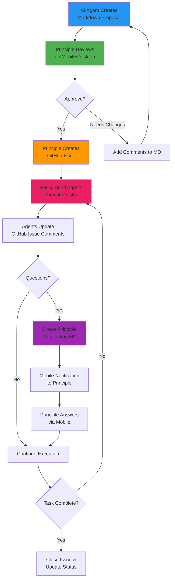
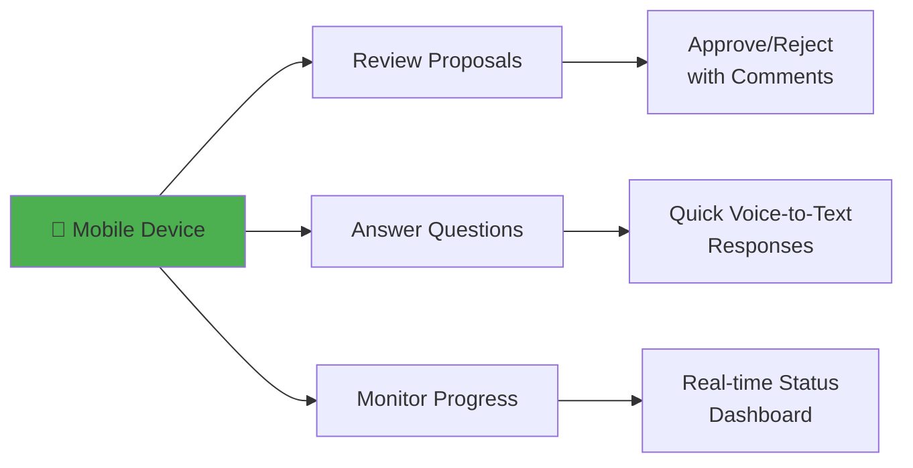

# Principle in the Loop: AI-Human Collaboration Workflow

This workflow revolutionizes how AI agents and human decision-makers collaborate on software projects.

**Status:** `Active Workflow`
**Principle:** `@Griever`
**Active Agents:** `3 Background Agents`
**Pending Reviews:** `2 Markdown Files`

---

## The Complete Workflow



---

## Example: Feature Development Flow

### 1. AI Agent Creates Initial Proposal

**File:** `proposals/user-authentication-refactor.md`

### 2. Principle Reviews & Approves

**Action:** ✅ Creates GitHub Issue #123

### 3. Background Agents Execute

**GitHub Issue #123:** "Refactor User Authentication System"
- Agent comments with progress updates
- Code commits linked automatically
- Status updates in real-time

### 4. Question Arises

**File:** `clarifications/auth-provider-choice.md` (auto-created)

### 5. Mobile Notification

📱 **Principle gets mobile alert:** "Clarification needed on auth provider choice"

---

## Mobile-First Principle Interface

The principle can manage everything from their phone:



---

## Benefits of This Workflow

### **For the Principle:**
- [x] **Mobile-first oversight** - Review and approve from anywhere
- [x] **High-level decision making** - Focus on strategy, not execution details
- [x] **Async communication** - No need for constant availability
- [x] **Clear audit trail** - Every decision documented in markdown

### **For AI Agents:**
- [x] **Clear instructions** - Unambiguous tasks from approved proposals
- [x] **Structured feedback loop** - Know exactly what questions to ask
- [x] **Progress tracking** - GitHub issues provide context and history
- [x] **Autonomy within bounds** - Execute freely within approved parameters

### **For the Team:**
- [x] **Transparent process** - All decisions and progress visible
- [x] **Scalable oversight** - One principle can manage multiple agent teams
- [x] **Quality assurance** - Human review before any significant changes
- [x] **Knowledge preservation** - Every decision and rationale documented

---

## Real-World Scenarios

### **Scenario 1: Bug Fix Workflow**
1. **Agent detects bug** → Creates `bug-reports/payment-timeout.md`
2. **Principle reviews** → Approves fix approach
3. **Issue created** → GitHub Issue #124 "Fix Payment Timeout"
4. **Agent executes** → Implements fix, updates issue
5. **Testing questions** → `clarifications/testing-scope.md`
6. **Mobile clarification** → "Test with high-load scenarios"
7. **Completion** → Issue closed, deployment approved

### **Scenario 2: Feature Request Processing**
1. **Customer request** → Agent creates `feature-requests/bulk-export.md`
2. **Principle evaluation** → Modifies scope, approves MVP version
3. **Implementation planning** → Issue #125 created with refined requirements
4. **Development** → Multiple agents collaborate on different components
5. **UX questions** → `clarifications/export-format-options.md`
6. **Quick mobile response** → "Start with CSV, JSON can wait"
7. **Delivery** → Feature shipped, customer notified

---

## Sample Files Structure

```
project-root/
├── proposals/           # AI-generated initial proposals
│   ├── user-auth-refactor.md
│   └── api-optimization.md
├── clarifications/      # Questions for principle
│   ├── auth-provider-choice.md
│   └── testing-scope.md
├── progress-reports/    # Automated status updates
│   └── weekly-summary.md
└── decisions/          # Approved decisions archive
    └── 2024-q3-decisions.md
```

---

## Next: See Individual Workflow Components

- **[Agent Proposal Example](./Agent-Proposal-Example.md)** - How agents create initial proposals
- **[Clarification Request](./Clarification-Request.md)** - Mobile-optimized questions for principles
- **[GitHub Integration](./GitHub-Integration.md)** - How GitHub issues bridge the workflow

> **The Revolutionary Advantage:** This workflow combines the speed and consistency of AI execution with the wisdom and judgment of human decision-making, all through simple markdown files and mobile interfaces. 