# Linux Commands Demystified

Stop Googling "how to do X in terminal". Here are the commands you actually need.

## File Operations Made Simple

```bash
find . -name "*.js" -type f
```

```bash
grep -r "TODO" --include="*.js" .
```

```bash
chmod +x script.sh
```

```prompt
I need to find all files containing {{search_term}} in my project, but exclude node_modules and .git folders
```

## The File System Detective

```mermaid
flowchart TD
    A["🔍 Find Files"] --> B["📁 Check Permissions"]
    B --> C["📊 Check Size"]
    C --> D["🗑️ Clean Up"]
    
    style A fill:#2196f3
    style B fill:#4caf50
    style C fill:#ff9800
    style D fill:#e91e63
```



## Disk Space Management

### See What's Taking Space
```bash
du -sh * | sort -hr
```

### Find Large Files
```bash
find . -size +100M -ls
```

### Check Disk Usage
```bash
df -h
```

### Clean Up Logs
```bash
sudo journalctl --vacuum-time=7d
```

```prompt
My server is running out of disk space. Help me identify what's consuming the most storage: {{df_output}}
```

## Text Processing Wizardry

### Count Lines of Code
```bash
find . -name "*.js" | xargs wc -l | tail -1
```

### Replace Text in Files
```bash
sed -i 's/old-text/new-text/g' *.txt
```

### Extract Columns
```bash
cut -d',' -f2 data.csv
```

### Sort and Deduplicate
```bash
sort file.txt | uniq
```

## File Permissions Simplified

```bash
# Read, Write, Execute for Owner, Group, Others
chmod 755 file.sh    # rwxr-xr-x
chmod 644 file.txt   # rw-r--r--
chmod 600 secret.key # rw-------
```

```bash
# Change ownership
chown user:group file.txt
```

## Archive & Compression

### Create Archive
```bash
tar -czf backup.tar.gz folder/
```

### Extract Archive
```bash
tar -xzf backup.tar.gz
```

### Zip Files
```bash
zip -r project.zip project/
unzip project.zip
```

```prompt
Help me create a backup script that archives {{directories}} and uploads to {{destination}}
```

## System Information

### Hardware Info
```bash
lscpu
free -h
lsblk
```

### Running Services
```bash
systemctl list-units --type=service --state=running
```

### Environment Variables
```bash
printenv | grep PATH
export MY_VAR="value"
```

## Log Analysis

### Real-time Logs
```bash
tail -f /var/log/syslog
```

### Search Logs
```bash
journalctl -u nginx --since "1 hour ago"
```

### System Boot Issues
```bash
dmesg | grep -i error
```

```prompt
My application is crashing. Help me analyze these log entries: {{log_entries}}
```

## Network File Operations

### Secure Copy
```bash
scp file.txt user@server:/path/to/destination/
```

### Remote Sync
```bash
rsync -avz local-folder/ user@server:/remote-folder/
```

### Download Files
```bash
wget https://example.com/file.zip
curl -O https://example.com/file.zip
```

## Pro Aliases to Save Time

```bash
alias ll='ls -la'
alias ..='cd ..'
alias grep='grep --color=auto'
alias df='df -h'
alias free='free -h'
```

> **Remember**: Linux commands are just tools. Each one does one thing well, and you can combine them like building blocks! 