# Network Troubleshooting Like a Pro

Stop saying "it's probably a network issue" and actually debug it.

## The Network Detective Flow

```mermaid
flowchart TD
    A["🔍 Check Connectivity"] --> B["📡 Test DNS"]
    B --> C["🚪 Check Ports"]
    C --> D["📊 Monitor Traffic"]
    D --> E["🔧 Fix Issue"]
    
    style A fill:#2196f3
    style B fill:#4caf50
    style C fill:#ff9800
    style D fill:#e91e63
    style E fill:#9c27b0
```



## Basic Connectivity Tests

### Ping Test
```bash
ping google.com
ping -c 4 8.8.8.8
```

### Trace Route
```bash
traceroute google.com
mtr google.com
```

### Check Network Interfaces
```bash
ip addr show
ifconfig
```

```prompt
My application can't connect to {{service_name}}. Help me diagnose if it's a network connectivity issue.
```

## DNS Troubleshooting

### DNS Lookup
```bash
nslookup google.com
dig google.com
```

### Check DNS Settings
```bash
cat /etc/resolv.conf
```

### Test Different DNS Servers
```bash
dig @8.8.8.8 google.com
dig @1.1.1.1 google.com
```

## Port and Service Testing

### Check Open Ports
```bash
netstat -tuln
ss -tuln
```

### Test Port Connectivity
```bash
telnet google.com 80
nc -zv google.com 80
```

### Check What's Using a Port
```bash
lsof -i :3000
fuser 3000/tcp
```

```prompt
Port {{port_number}} seems to be in use but I can't find what's using it. Help me investigate.
```

## Network Traffic Analysis

### Monitor Real-time Connections
```bash
netstat -i 1
```

### Check Bandwidth Usage
```bash
iftop
nethogs
```

### Capture Network Packets
```bash
tcpdump -i eth0 port 80
```

## Firewall Debugging

### Check Firewall Status
```bash
sudo ufw status
sudo iptables -L
```

### Test Port Accessibility
```bash
nmap -p 80,443 example.com
```

### Check SELinux (if applicable)
```bash
sestatus
sudo ausearch -m avc -ts recent
```

## HTTP/API Debugging

### Test HTTP Endpoints
```bash
curl -v https://api.example.com/health
```

### Check Response Headers
```bash
curl -I https://example.com
```

### Test with Different Methods
```bash
curl -X POST -H "Content-Type: application/json" \
  -d '{"key":"value"}' https://api.example.com/data
```

```prompt
My API is returning 500 errors. Help me debug this curl request: {{curl_command}}
```

## SSL/TLS Certificate Issues

### Check Certificate
```bash
openssl s_client -connect example.com:443
```

### View Certificate Details
```bash
echo | openssl s_client -connect example.com:443 2>/dev/null | openssl x509 -text
```

### Check Certificate Expiry
```bash
echo | openssl s_client -connect example.com:443 2>/dev/null | openssl x509 -dates -noout
```

## Network Performance Testing

### Speed Test
```bash
speedtest-cli
```

### Bandwidth Testing
```bash
iperf3 -c server-ip
```

### Latency Testing
```bash
ping -c 100 server-ip | tail -1
```

## Common Network Issues & Solutions

### DNS Cache Issues
```bash
sudo systemctl restart systemd-resolved
sudo dscacheutil -flushcache  # macOS
```

### Reset Network Interface
```bash
sudo ip link set eth0 down
sudo ip link set eth0 up
```

### Check Routing Table
```bash
ip route show
route -n
```

```prompt
My Docker containers can't reach the internet. Help me debug the network configuration: {{docker_network_ls}}
```

## Monitoring Network Health

### Connection Statistics
```bash
ss -s
netstat -s
```

### Check Network Errors
```bash
cat /proc/net/dev
```

### Monitor DNS Queries
```bash
dig +trace example.com
```

## Pro Tips for Network Debugging

1. **Always test connectivity first** - `ping` before anything else
2. **Check both ways** - Client to server AND server to client
3. **Test from different locations** - Local network vs external
4. **Use multiple tools** - Different tools show different perspectives
5. **Document your findings** - Network issues are complex

```prompt
Create a network troubleshooting checklist for when {{application_name}} can't connect to {{external_service}}
```

> **Remember**: Network issues are rarely mysterious once you know which tools to use. Work systematically from the basics up! 