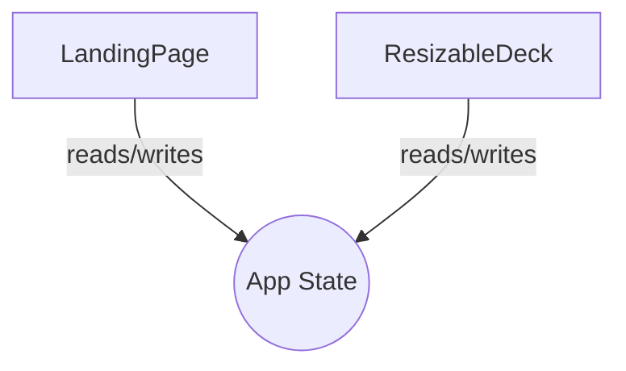

# Welcome to principle.md 

This is a test slide for the VSCode extension.

- Feature 1: Markdown slides
- Feature 2: Mermaid diagrams

## Mermaid Diagram Example

## Final Slide

Thank you for testing!

Press `Ctrl+Shift+V` to open the preview.