# Edit Slides With Ease 

This tutorial demonstrates how our markdown slide renderer supports dynamic slide management, allowing you to reorder and delete slides seamlessly during your presentation.

## 1. Reordering Slides

### Visual Example: Before Reordering

### After Reordering

### Drag and Drop Method

The most intuitive way to reorder slides is through our drag-and-drop interface:

1. **Enter Edit Mode**: Click the "Edit" button or press `Ctrl+E`
2. **Select Slide**: Hover over any slide thumbnail in the sidebar
3. **Drag to Position**: Click and drag the slide to your desired position
4. **Drop and Confirm**: Release to place the slide in its new location

## 2. Deleting Slides

### Visual Example: Before Deletion

This shows a larger presentation with 7 slides:

### After Deletion

Here's the same presentation after deleting slides 3, 5, and 6 to create a more focused presentation:

```mermaid
graph LR 
    A["Introduction"] --> C["Overview"]
    C --> D["Examples"]
    D --> G["Conclusion"]
    
    F["❌ Case Studies<br/>(DELETED)"]
    
    style A fill:#2196f3
    style B fill:#4caf50
    style C fill:#ff9800
    style D fill:#e91e63
    style G fill:#9c27b0
    style E fill:#d32f2f,stroke:#b71c1c,stroke-dasharray: 5 5
    style F fill:#d32f2f,stroke:#b71c1c,stroke-dasharray: 5 5
```

### Single Slide Deletion

Remove slides quickly and safely:

1. **Select Target Slide**: Click on the slide you want to delete
2. **Delete Action**: Press `Delete` key or click the trash icon
3. **Confirm Deletion**: A confirmation dialog prevents accidental removals
4. **Immediate Update**: The presentation updates instantly

## Why This Matters:
- Adapt presentations on the fly based on audience needs
- Remove irrelevant content during live sessions
- Reorganize flow for better storytelling
- Create multiple presentation variants from the same source