# Interactive Markdown Files 

Hit the run command

```bash
npm run dev
```

## No More Copy And Paste 


## Useful for you and your Agents

```mermaid
flowchart TD
    MD["📄 Interactive Markdown<br/>Commands & Code"]
    Person["👤 Human User"]
    Agent["🤖 AI Agent"]
    
    MD --> Person
    MD --> Agent
    Person --> |"Executes Commands"| Terminal["💻 Terminal"]
    Agent --> |"Runs Scripts"| Terminal
    Terminal --> |"Results"| Person
    Terminal --> |"Output"| Agent
    
    style MD fill:#2196f3
    style Person fill:#4caf50
    style Agent fill:#ff9800
    style Terminal fill:#9c27b0
```




## React Project Commands

Here are useful commands for React development that you can execute directly:

### Start Development Server
```bash
npm start
```

### Install Dependencies
```bash
npm install
```

### Run Tests
```bash
npm test
```

### Build for Production
```bash
npm run build
```

### Check for Outdated Packages
```bash
npm outdated
```

### Create a New React Component
```bash
npx generate-react-cli component MyComponent
```

### Analyze Bundle Size
```bash
npm run build && npx serve -s build
```

### Run ESLint
```bash
npx eslint src/
```

## Use Cases

This functionality is particularly useful for:
- Creating live documentation that shows current system state
- Demonstrating command-line tools and their output
- Building interactive tutorials
- Generating dynamic content based on real-time data

> **Note**: Be cautious when executing commands in markdown documents, especially in shared environments, as this feature has security implications.
