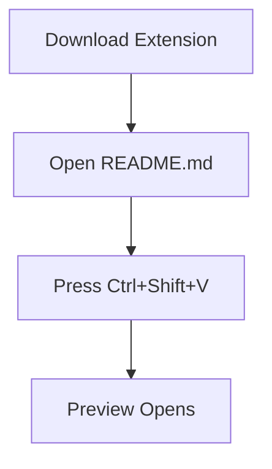

# Start with your README.md 

See how your README.md renders as a presentation

Press `Ctrl+Shift+V` to open the preview.

## Render The Images In Your Directory 

## Include An Architecture Diagram 

